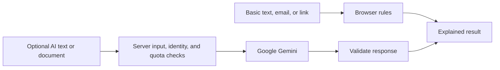

# Credify: what changed, why, and how to review it

Prepared September 28, 2026. This is a review of the work from the starting snapshot, `d077f90`, through `e2eb87b`. It explains the final implementation, the decisions behind it, and what still needs inspection. It is not a new implementation plan or a claim that hosted services have been verified.

**Git boundary:** the owner handles staging, committing, and pushing. The assistant should prepare changes, explanations, commands, and commit messages for the owner to run. This is the latest instruction and supersedes earlier authorization language elsewhere in the repository. Creating this review does not authorize Git mutations.

## 1. Scope and history

The work covered the UI, scanner behavior, authentication, database access policies, API contracts, configuration, tests, and documentation. The comparison contains **155 changed files**, including screenshots, dependency-lockfile changes, generated-file removals, and obsolete components.

| Checkpoint | What it contains                                                                                                        |
| ---------- | ----------------------------------------------------------------------------------------------------------------------- |
| `d077f90`  | Starting snapshot used for the review.                                                                                  |
| `4d0e300`  | Application rebuild, account/security changes, tests, documentation, and the initial green/cream UI.                    |
| `1e43114`  | Restoration of the earlier indigo/cyan visual identity.                                                                 |
| `e2eb87b`  | Final UI refinements, direct Verifiers navigation, scanner improvements, CSS resolution fix, and documentation handoff. |

The first visual pass changed the identity too much. Later passes restored the earlier direction and incorporated the owner's corrections. These checkpoints preserve that history; the final application should be assessed against the latest preferences, not an intermediate screenshot.

## 2. Initial audit and implementation plan

The original audit identified substantive behavior problems alongside visual inconsistencies:

- The checked-in database policies allowed public profile operations without ownership checks.
- The UI treated browser-local account data as identity, and the server used a shared Supabase client.
- Account deletion accepted a caller-supplied target and deleted only a profile row.
- Password settings could report success without actually changing the password; the recovery destination was missing.
- The verification API could return a score of 35 and a High Risk result after AI analysis failed.
- The link checker could label a URL safe based on the absence of a few suspicious words.
- Provider calls lacked explicit application-level input and spending boundaries.
- Several marketing actions and feature claims did not correspond to implemented behavior.
- The reviewed repository had no automated test suite or CI workflow.

The audit, priorities, and proposed delivery sequence are preserved in [IMPLEMENTATION_PLAN.md](IMPLEMENTATION_PLAN.md). Those findings describe the original code. In particular, the original SQL is not evidence that the same policies were applied to the hosted database; that environment was not inspected.

**Inspect:** use the implementation plan to understand the motivation, and [docs/STATUS.md](docs/STATUS.md) to distinguish delivered behavior from proposals and remaining checks.

## 3. Visual foundation, themes, and favicon

Shared CSS variables now define surfaces, text, borders, controls, and semantic colours. The final palette uses:

| Role                     | Current treatment                                                              |
| ------------------------ | ------------------------------------------------------------------------------ |
| Page and card surfaces   | White and cool light surfaces; navy and slate dark surfaces.                   |
| Primary buttons          | Charcoal with white text in light mode; off-white with navy text in dark mode. |
| Headline accents         | Blue-to-teal in light mode; blue-to-cyan in dark mode.                         |
| Guidance and follow-up   | Blue and teal text and icons.                                                  |
| Caution findings         | Red text and soft red backgrounds, paired with explanatory wording and icons.  |
| General advisory notices | Amber.                                                                         |

The colour changes preserve the approved button appearance. Red draws attention to a finding; it does not establish fraud. An inconclusive result does not receive a green safety treatment.

Spacing, card layouts, fields, mobile typography, focus outlines, and reading surfaces were made more consistent. System fonts replaced the Google Fonts dependency that prevented a build when font downloads were unavailable. Theme selection follows the system initially and can be overridden in the browser.

The favicon is a custom SVG: a rounded navy tile containing a white shield and cyan check. It replaces the old ICO asset and scales cleanly. Browser theme colours were updated too.

**Implementation:** [app/globals.css](app/globals.css), [app/icon.svg](app/icon.svg), [components/ui.tsx](components/ui.tsx), and the feature styles under [styles/](styles/). The current reference is [docs/DESIGN.md](docs/DESIGN.md).

**Inspect:** both themes, narrow screens, field focus, selected modes, errors, disabled controls, and long text. Evaluate actual content and interaction states as well as the initial home screen.

## 4. Landing page, walkthrough, and navigation

The first screen now explains what to submit and shows a fictional offer with visible findings and a practical next step. The example no longer requires an extra reveal interaction to demonstrate the product's value.

The home page continues through a scroll-linked walkthrough, input choices, common questions, and another scanner entry point. The rebuilt How it works page shares a concrete sequence:

**Paste what you received → understand the findings → confirm independently.**

The final header contains **Check an offer**, **Verifiers**, **How it works**, and **Safety hub**, with account access alongside them. The logo returns home. The mobile menu closes after navigation or Escape, and Escape returns focus to its trigger.

The request to remove the Verifiers dropdown was initially misinterpreted as removing its header link as well. That was corrected. **Verifiers is a direct link to its existing page on desktop and mobile; only its dropdown is removed.** The separate Home item remains removed.

**Implementation:** [app/page.tsx](app/page.tsx), [app/how-it-works/page.tsx](app/how-it-works/page.tsx), [components/OfferPreview.tsx](components/OfferPreview.tsx), [components/ReviewSteps.tsx](components/ReviewSteps.tsx), [components/Navbar.tsx](components/Navbar.tsx), and [components/Footer.tsx](components/Footer.tsx).

**Inspect:** whether a new visitor understands the purpose immediately, whether the scroll destination clears the sticky header, and whether every navigation label matches its destination. One remaining footer mismatch is recorded below.

## 5. Scanner logic: explained findings instead of safety scores

Basic checks now use deterministic rules in the browser. Their operation does not require an account, backend request, or AI provider call.

| Input         | What it checks                                                                                                                         | What it does not establish                                                |
| ------------- | -------------------------------------------------------------------------------------------------------------------------------------- | ------------------------------------------------------------------------- |
| Offer text    | Specific English-language patterns involving fees, urgency, sensitive information, messaging apps, and unusually easy hiring promises. | Whether the opportunity exists or is legitimate.                          |
| Email address | The complete written domain and properties such as common public mailbox providers.                                                    | Mailbox ownership, message authenticity, or employer affiliation.         |
| Website link  | Hostname, protocol, and selected unusual address structures.                                                                           | Malware reputation or website legitimacy; the website is not visited.     |
| Document      | Optional AI-assisted analysis of supported files.                                                                                      | Authentic signatures, document provenance, or verified employer identity. |

The earlier domain-extraction logic could truncate legitimate domains. The replacement preserves the written email domain and parses web addresses with the URL parser. Non-HTTP(S) addresses and embedded URL credentials are rejected.

Results have two statuses: `attention` and `inconclusive`. They contain findings, supporting excerpts where available, next steps, limitations, a timestamp, a stable review ID, and a method version. Numeric safety probabilities and safe/verified verdicts were removed from the review contract.

This is a deliberate capability boundary. A pattern match gives a person something specific to investigate. It can still misread context, flag legitimate wording, or miss unfamiliar language.

**Implementation:** [local.ts](lib/verification/local.ts), [domains.ts](lib/verification/domains.ts), and [contracts.ts](lib/verification/contracts.ts).

**Inspect:** read the actual rules and try positive, ordinary, and ambiguous examples. A message saying it will never request a registration fee can still match wording about a fee; these rules do not fully understand negation.

## 6. Scanner interaction and report handling

The scanner now has clearer mode descriptions, input guidance, validation, progress/error states, cancellation, and distinct result sections.

- **Edit input** preserves the draft, clears the result, and returns keyboard focus to the input.
- Editing input or changing modes/analysis choices clears the old result so it cannot be mistaken for a review of the new content.
- Inputs and file replacement are restricted while a review is pending.
- Results receive focus when ready.
- **Copy report** copies the findings and guidance, with an explanatory fallback if clipboard access fails.
- `/demo` runs the real local rules against labelled fictional content.
- Inputs and results are temporary; leaving or refreshing the scanner loses them. No account-backed report history was added.

**Implementation:** [Scanner.tsx](components/scanner/Scanner.tsx) and [ScanResult.tsx](components/scanner/ScanResult.tsx).

**Inspect:** run the demo, edit it, switch modes, submit invalid input, and copy a report. Check that a previous result or validation error disappears when the relevant input changes.

## 7. Accounts, sessions, passwords, and deletion

| Area                 | What changed                                                                                                            | Why                                                                                 |
| -------------------- | ----------------------------------------------------------------------------------------------------------------------- | ----------------------------------------------------------------------------------- |
| Sign-in              | Server-managed Supabase session cookies replace browser-local identity assumptions.                                     | A stored email address is not proof of authentication.                              |
| Supabase access      | Authenticated clients are created per request.                                                                          | Authentication state should not be shared between users through a singleton.        |
| Protected operations | The server verifies the user through Supabase Auth.                                                                     | UI visibility and browser values cannot authorize account actions.                  |
| Profiles             | Database-backed reads and updates replace localStorage profile persistence.                                             | Edits should belong to the authenticated account and survive a new browser session. |
| Password changes     | A dedicated route updates the password after credential verification.                                                   | Sending a recovery email is different from changing a password.                     |
| Recovery             | Confirmation callbacks and a password-update page complete the flow.                                                    | The previous recovery destination was missing.                                      |
| Deletion             | Password and typed confirmation are required; the server derives the target from the session and deletes the Auth user. | A caller must not select another account by submitting its email or ID.             |

Cookies are HttpOnly, SameSite=Lax, and Secure in production. Login does not return authentication tokens as a browser payload. Legacy preview-profile values are cleared rather than imported into real accounts. User-ID sign-in was retired in favour of email sign-in.

Recovery uses a signed permission token tied to the verified user and session, expiring after 15 minutes. An arbitrary redirect parameter or user-ID cookie cannot grant recovery permission. Deleting the Auth user removes its profile through the existing database relationship.

**Implementation:** [lib/supabase/server.ts](lib/supabase/server.ts), [lib/auth/recovery-proof.ts](lib/auth/recovery-proof.ts), [account components](components/account/), and [API contracts](docs/API.md).

**Inspect:** confirmation, sign-in persistence, profile edits, sign-out, password change, valid/expired recovery links, and deletion using disposable test accounts. These are implemented and covered by isolated tests, but real email delivery and hosted account behavior still need verification.

## 8. Database migration and company registry

A new forward migration was added instead of rewriting the old migrations. It:

- Removes the old public profile-access policies and API grants.
- Restricts profile reads and updates to the owning authenticated account.
- Limits editable columns to display name, occupation, and location.
- Creates profiles through an Auth trigger and synchronizes email changes.
- Adds company verification status, method, review date, and expiry requirements.
- Leaves seeded example companies pending instead of automatically treating them as reviewed employers.
- Limits public company access to approved columns on reviewed, unexpired records.

`/search` now performs real registry queries when configured. `/verify/[domain]` shows the method and dates associated with a public record. That record does not authenticate a person who shares its link.

**Implementation:** [202609270001_harden_profiles.sql](supabase/migrations/202609270001_harden_profiles.sql), [lib/registry/companies.ts](lib/registry/companies.ts), [app/search/page.tsx](app/search/page.tsx), and [the company-record page](app/verify/[domain]/page.tsx).

**Deployment boundary:** this migration was not applied to hosted Supabase by this work. Isolated PostgreSQL policy tests passed, but hosted schema drift, existing data, policies, and grants need inspection. The migration changes which seeded company records are visible. Rehearse it against an isolated copy before a real-data rollout.

## 9. AI processing, privacy, and request limits



Basic website checks do not upload their input. Optional AI sends content through the server to Google Gemini after the relevant opt-in or processing consent. The app does not intentionally persist raw submissions or reports; hosting/provider retention is a separate deployment concern.

Added controls include bounded request reading, input schemas, file-size/type/base64/signature checks, provider deadlines, and structured response validation. Text-warning excerpts must appear in the submitted text. A provider failure is an error, never an invented completed assessment.

Current limits include:

| Boundary               | Current value or behavior                                                           |
| ---------------------- | ----------------------------------------------------------------------------------- |
| Offer text             | 20–12,000 trimmed characters.                                                       |
| Email                  | Valid address, at most 254 characters.                                              |
| Link                   | At most 2,048 characters; HTTP(S), without embedded credentials.                    |
| Documents              | PDF, PNG, or JPEG; at most 2 MiB decoded.                                           |
| Verification JSON body | At most 3 MiB, accounting for encoded file transport.                               |
| AI quota               | 10 requests per user per hour; configurable global daily cap, default 100 requests. |
| Shared limiter failure | Paid AI calls do not proceed.                                                       |

The daily cap counts requests, not exact currency spend. Provider billing controls remain separate.

The assistant is a bounded, authenticated, single-question interaction. It does not receive conversation history, browse the web, or claim hidden memory. It has explicit timeout/error handling.

**Implementation:** [gemini.ts](lib/verification/gemini.ts), [file.ts](lib/verification/file.ts), [rate-limit.ts](lib/rate-limit.ts), [api/verify](app/api/verify/route.ts), [api/chat](app/api/chat/route.ts), and [Chatbot.tsx](components/Chatbot.tsx).

**Inspect:** failed requests, unreadable files, unsupported formats, missing consent, malformed provider output, and unavailable limits. These controls do not solve hallucination or prompt injection, and they do not authenticate a document.

## 10. API contracts and shared security controls

Routes now use explicit schemas, bounded JSON readers, consistent errors, no-store responses, and matching-Origin checks for custom mutations. Protected account operations separately check identity and ownership.

The server logs operational completion metadata rather than submitted content. Raw provider errors are not returned to users. Findings are rendered as text; the previous free-form Markdown report renderer was removed. Submitted URLs are parsed rather than fetched.

[next.config.ts](next.config.ts) now disables the framework signature and sets framing, content-type, referrer, browser-permission, and limited Content Security Policy headers. Auth redirects have additional no-store and no-referrer protections. The CSP is not a full nonce-based script policy; final headers still need checking behind the deployed host.

**Compatibility change:** the old verification request/response shapes, including `letterText`, `trustScore`, and `isVerified`, were replaced. Account deletion has a different request contract, and sign-in now uses email rather than a custom user ID.

If another client uses these endpoints—including an APK, if it depends on them—it needs a compatibility check. The web tests do not prove external-client compatibility.

**Inspect:** [docs/API.md](docs/API.md), [lib/http.ts](lib/http.ts), and [docs/SECURITY.md](docs/SECURITY.md).

## 11. Supporting pages and removed claims

| Page or feature                  | Current behavior                                                                                               |
| -------------------------------- | -------------------------------------------------------------------------------------------------------------- |
| Safety hub                       | Explains checks and limitations and contains the optional assistant.                                           |
| Intelligence                     | Attributed DEV Community reading feed with validation, timeout, caching, and fallback; not a live threat feed. |
| TrustScore                       | Explains the approach and limitations instead of presenting an unsupported safety percentage.                  |
| Student stories                  | Explicitly fictional learning scenarios.                                                                       |
| Employer tools                   | Planned workflows; no pretend self-service onboarding or paid checkout.                                        |
| Browser extension                | A concept without an installable extension.                                                                    |
| Android download                 | Existing APK retained, labelled experimental, with file checksums.                                             |
| Privacy, terms, and security     | Real routes explaining current behavior and boundaries.                                                        |
| Support and emergency guide      | Revised guidance, links, and presentation.                                                                     |
| Error, loading, and missing page | Shared route states.                                                                                           |
| Metadata and robots              | Updated page metadata, theme colours, and crawler exclusions.                                                  |

Fabricated activity, unsupported verification claims, inactive pricing/install actions, and obsolete presentation components were removed. Report history, avatars, subscription billing, automatic employer approval, advanced document forensics, and live URL reputation checks were not implemented.

**Inspect:** product promises, legal/operator information, and support contacts before a public service launch. Existing APK binaries were not modified or audited. Checksums identify files; they do not certify safety.

## 12. Framework, repository, and development tooling

Next.js and its ESLint configuration changed from 16.2.4 to 16.3.6. React 19 and Tailwind 4 remain. Node 24 is selected by `.nvmrc` and CI; the declared runtime range is Node 24 through 26.

Added Zod, Supabase SSR support, server-only boundaries, Vitest, Playwright, axe, embedded PostgreSQL tests, and Prettier. Removed unused or superseded Cloud Vision, Mongoose, bcryptjs, form-data, pdf-lib, whoiser, and Markdown report-rendering dependencies. The Supabase CLI moved to development dependencies and was updated. The lockfile records the resulting dependency changes.

Added explicit lint, typecheck, test, browser-test, and formatting commands. EditorConfig, Git attributes, Prettier, and ESLint configuration make formatting and line endings consistent. Obsolete Tailwind configuration, scratch files in version control, and generated TypeScript artifacts were removed from tracked source.

`.gitignore` now covers local environment files, private key formats, dependencies, build caches, generated files, browser reports, logs, local experiments, and editor temporary files. The sanitized `.env.example`, lockfile, source, migrations, tests, and documentation remain included. Ignore rules do not erase files already committed to Git history.

The CSS resolution error reported during the UI work was reproduced as a development-server HTTP 500. Local stylesheet imports were moved from `globals.css` into [app/layout.tsx](app/layout.tsx), preserving their order. Next now handles these imports directly, while `globals.css` imports the Tailwind package.

**Inspect:** [package.json](package.json), [.gitignore](.gitignore), [.env.example](.env.example), [next.config.ts](next.config.ts), and [the CI workflow](.github/workflows/ci.yml).

## 13. Configuration: working Supabase is one dependency

Current product copy assumes working connected services instead of advertising a temporary backend pause. Runtime availability still follows explicit configuration.

Restarting Supabase alone does not enable every connected feature:

| Feature               | Dependencies to inspect                                                                                       |
| --------------------- | ------------------------------------------------------------------------------------------------------------- |
| Accounts              | `CREDIFY_AUTH_ENABLED`, Supabase URL/public key, `AUTH_COOKIE_SECRET`, and shared Redis limits in production. |
| Registry              | `CREDIFY_REGISTRY_ENABLED`, Supabase configuration, and the expected database schema/policies.                |
| AI                    | `CREDIFY_AI_ENABLED`, working account configuration, Gemini key/model, and shared Redis limits.               |
| Account deletion      | Server-only service-role key in addition to the account requirements.                                         |
| Recovery/confirmation | Correct email templates, Site URL, redirect URLs, and signing secret.                                         |

Default flags support credential-free basic development. Configured features should be verified against the intended deployment, rather than enabled by merely placing a provider key in a file.

**Inspect:** [lib/config.ts](lib/config.ts), [supabase/config.toml](supabase/config.toml), the [email templates](supabase/templates/), and [docs/OPERATIONS.md](docs/OPERATIONS.md). Keep populated environment files out of source control.

## 14. Tests and what they prove

These are the latest recorded results for the reviewed implementation, not tests rerun merely to create this document:

| Check                              | Recorded result                                                                            |
| ---------------------------------- | ------------------------------------------------------------------------------------------ |
| Lint and TypeScript                | Passed.                                                                                    |
| Unit/API/PostgreSQL tests          | 73 passed.                                                                                 |
| Production Chromium tests          | 18 passed.                                                                                 |
| Production build                   | Passed.                                                                                    |
| Formatting and documentation links | Passed.                                                                                    |
| Latest additional visual review    | 22 page/theme/viewport states without horizontal overflow, page errors, or axe violations. |

Coverage includes local analysis, input boundaries, malformed provider responses, recovery permissions, account API behavior, database ownership, scanner editing, navigation, and accessibility checks. SQL tests use PGlite; provider tests use controlled doubles. Browser tests disable connected services so they do not mutate real accounts or invoke paid analysis.

Not established by these results:

- Hosted Supabase policy correctness or schema compatibility.
- Real email delivery, token refresh, recovery, or account deletion.
- Real Gemini model availability, retention configuration, and quality.
- Real Redis behavior across deployed instances or provider billing controls.
- External API client or Android compatibility.
- Complete accessibility, screen-reader, or real-device coverage.
- The current remote CI or hosting deployment outcome.

The existing Next loading behavior also requires JavaScript to reveal streamed route content. Server-rendered examples do not imply that the entire app supports JavaScript being disabled.

**Inspect:** [docs/TESTING.md](docs/TESTING.md), [docs/STATUS.md](docs/STATUS.md), and [tests/](tests/). Structured operational logs were added, but deployed monitoring and alerts were not established by these changes.

## 15. Documentation map

| Need                                    | Start here                                         |
| --------------------------------------- | -------------------------------------------------- |
| Install and run                         | [README.md](README.md)                             |
| Understand the original audit           | [IMPLEMENTATION_PLAN.md](IMPLEMENTATION_PLAN.md)   |
| Use the app                             | [User guide](docs/USER_GUIDE.md)                   |
| Understand current visual rules         | [Design reference](docs/DESIGN.md)                 |
| Understand code boundaries              | [Architecture](docs/ARCHITECTURE.md)               |
| Extend the project                      | [Development guide](docs/DEVELOPMENT.md)           |
| Configure services and migrations       | [Operations](docs/OPERATIONS.md)                   |
| Integrate with endpoints                | [API contracts](docs/API.md)                       |
| Review access and privacy boundaries    | [Security](docs/SECURITY.md)                       |
| Reproduce verification                  | [Testing](docs/TESTING.md)                         |
| See delivered work and remaining checks | [Delivery record](docs/STATUS.md)                  |
| Review the previous source handoff      | [Upload guide](docs/UPLOAD.md)                     |
| See historical visual decisions         | [UI restoration plan](docs/UI_RESTORATION_PLAN.md) |

Screenshots live in [docs/images/](docs/images/). Historical plans and dated delivery entries intentionally describe earlier states; use the latest instructions and current implementation for new work.

## 16. Known inconsistencies found during this review

These findings are recorded for follow-up; creating this document does not fix them:

1. **Footer destination mismatch:** the “AI assistant” link in [Footer.tsx](components/Footer.tsx) points to `/intelligence`, which is the reading feed. The assistant is rendered on the Safety hub. The label or destination should be corrected.
2. **Git preference documentation:** [brain.md](brain.md) still records the earlier commit/push authorization. The owner's latest instruction is that staging, committing, and pushing remain the owner's actions. That latest instruction controls; older authorization wording should be reconciled in a future documentation update.

## 17. Suggested hands-on review

| Done | Inspect                              | Expected behavior                                                                            |
| ---- | ------------------------------------ | -------------------------------------------------------------------------------------------- |
| ☐    | Home in both themes                  | Purpose is clear; buttons, example, and scroll link make sense.                              |
| ☐    | Desktop and mobile navigation        | Verifiers opens directly, no dropdown remains, and the logo returns home.                    |
| ☐    | How it works                         | Three concrete steps describe what the scanner actually does.                                |
| ☐    | Demo review                          | Findings correspond to the fictional sample's wording.                                       |
| ☐    | Edit input and switch modes          | Draft survives editing; outdated reports and errors disappear.                               |
| ☐    | Email and link checks                | Full domains are shown; ordinary-looking input is not declared safe.                         |
| ☐    | Accounts in a disposable environment | Confirmation, persistence, recovery, password changes, and deletion work.                    |
| ☐    | Migration and registry               | Ownership restrictions hold; pending, revoked, or expired records are not public.            |
| ☐    | Optional AI                          | Consent, limits, failures, cancellation, and provider configuration behave as described.     |
| ☐    | Public-facing copy                   | Product promises, support contacts, and legal/operator information match the actual service. |
| ☐    | External API clients                 | Request and response contracts are compatible with the rebuilt endpoints.                    |

## 18. Read-only Git inspection commands

These inspect the reviewed snapshot without staging, committing, pushing, or changing files:

```bash
git diff --stat d077f90..e2eb87b
git diff --name-status d077f90..e2eb87b

# Account, API, and database changes
git diff d077f90..e2eb87b -- app/api lib supabase

# Pages, components, and styles
git diff d077f90..e2eb87b -- app components styles

# Dependencies and configuration
git diff d077f90..e2eb87b -- package.json next.config.ts .gitignore

# Examine each delivery checkpoint
git show --stat 4d0e300
git show --stat 1e43114
git show --stat e2eb87b
```
