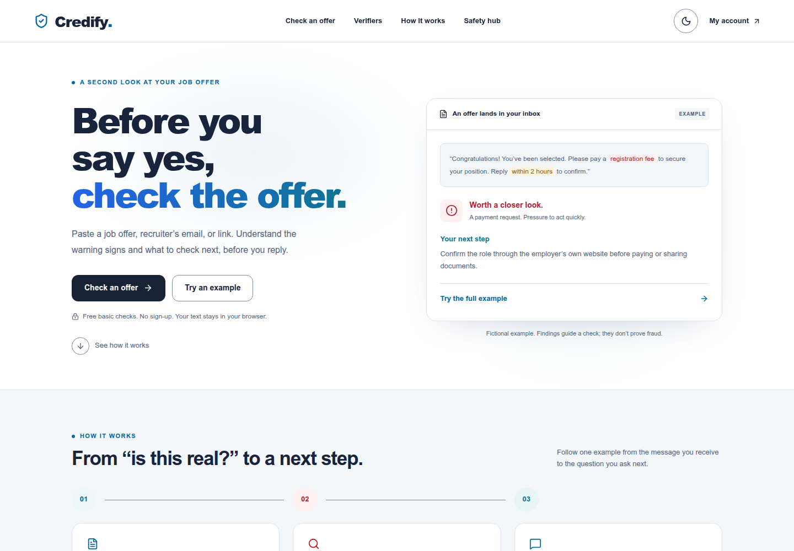

# Credify

A thoughtful second look at a job offer. Credify helps people inspect offer text, recruiter email domains, and website addresses, with clear findings and practical next steps.

**Basic checks work entirely in the browser, without an account or backend.** Optional account, company-registry, and AI services are explicitly enabled. Configure Supabase and the service dependencies for connected features; see [operations](docs/OPERATIONS.md).



[Dark theme](docs/images/home-desktop-dark.png) · [Mobile scanner](docs/images/scanner-mobile.png) · [Example result](docs/images/results-mobile.png)

## Start here

Use Node.js 24 (see `.nvmrc`) and npm.

```bash
npm ci
test -e .env.local || cp .env.example .env.local
npm run dev
```

If `.env.local` already exists, preserve it and compare its variable names with the example instead of overwriting it. The default flags support credential-free development. Enable the features you configure using the operations guide. Open [localhost:3000](http://localhost:3000).

The home page leads from an example offer into a visual three-step walkthrough. Primary navigation links directly to the checker, Verifiers, How it works, and Safety hub. Try `/demo` for a fictional offer using the real local analysis rules. `/job-scanner` supports text, email, and link checks. `/help-center` explains the checks and limitations. The interface supports light/dark themes, mobile layouts, keyboard navigation, and reduced-motion preferences. Fonts are local system fonts; builds do not download Google Fonts.

The [user guide](docs/USER_GUIDE.md) covers each check, editing and copying a report, keyboard controls, and connected services. For repository uploads or a website deployment, follow the [upload and handoff guide](docs/UPLOAD.md).

## What is implemented

| Capability                | Behavior                                                                                                                                                                             |
| ------------------------- | ------------------------------------------------------------------------------------------------------------------------------------------------------------------------------------ |
| Offer text review         | Bounded, English-language pattern checks running on the device. Shows supporting excerpts and limitations.                                                                           |
| Email and link inspection | Parses the full written domain/hostname without authenticating the sender or visiting the submitted URL.                                                                             |
| Optional AI review        | Consent-based text/PDF/PNG/JPEG processing through Gemini; authenticated, rate-limited, capped, schema-validated, and time-bounded. Disabled by default.                             |
| Accounts                  | Supabase Auth with server-managed cookies, confirmation, login/logout, password recovery/change, profile editing, and authenticated deletion. Enabled through account configuration. |
| Company registry          | Searches approved, unexpired public records. Legacy demo company rows remain pending. Disabled by default.                                                                           |
| Safety resources          | Practical guidance, fictional learning scenarios, transparent feature availability, and attributed external reading.                                                                 |
| Android preview           | Existing APK download retained with checksums; its source and behavior are outside this web repository’s verification.                                                               |

There are no numeric safety probabilities, inbox scanning, real-time threat databases, paid subscriptions, stored scan histories, or self-service employer approval workflows. The browser extension and employer onboarding are explicitly described as planned. See [delivery status](docs/STATUS.md) for verification evidence and remaining deployment gates.

## Quality commands

```bash
npm run check          # lint, generated Next route types, TypeScript, unit/API/Postgres tests
npm run build          # production compilation and prerendering
npm run format:check   # consistent source and documentation formatting
npx playwright install chromium
npm run test:e2e       # local browser journeys, mobile checks, and axe accessibility checks
```

Browser tests start a development server on port 3100 with hosted services disabled. Stop another Next dev server for this checkout first: Next uses a shared `.next/dev` lock. CI installs Chromium automatically. In constrained environments, `PLAYWRIGHT_CHROMIUM_EXECUTABLE_PATH` can point to an already installed Chromium; it is optional, not a project requirement.

After building, run `PLAYWRIGHT_USE_PRODUCTION=true npm run test:e2e` to exercise the production server. CI uses this mode. Port 3100 must be free; the tests deliberately do not reuse a potentially connected development server.

`npm test` runs without Docker, Supabase credentials, Gemini calls, or a Redis service. SQL policy tests use embedded PostgreSQL through PGlite; they do not certify a hosted Supabase configuration. Provider integration tests use controlled doubles. See [testing](docs/TESTING.md).

## Work on the project

- [User guide and troubleshooting](docs/USER_GUIDE.md)
- [UI and design reference](docs/DESIGN.md)
- [Architecture and design decisions](docs/ARCHITECTURE.md)
- [Development and extension guide](docs/DEVELOPMENT.md)
- [Environment, local Supabase, and deployment](docs/OPERATIONS.md)
- [API contracts](docs/API.md)
- [Security boundaries and data handling](docs/SECURITY.md)
- [Testing and release checks](docs/TESTING.md)
- [Delivery status and known limitations](docs/STATUS.md)
- [Upload and handoff](docs/UPLOAD.md)
- [Agent context](brain.md)

The stack is Next.js 16.3.6, React 19, TypeScript, Tailwind CSS 4, Supabase, and the Google GenAI SDK. Runtime versions are pinned or constrained in `package.json` and resolved in `package-lock.json`. Read the installed Next.js guides in `node_modules/next/dist/docs/` before changing framework integration; this project intentionally follows the APIs of its installed version.
