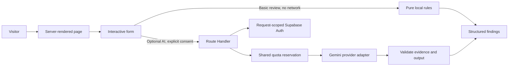

# Architecture

Credify is one Next.js application. There is no separate API service, global client-state framework, job queue, or generic repository abstraction. Add those only when an observed requirement justifies them.

## Request and rendering model

- `app/`: route definitions, metadata, thin HTTP handlers, error/loading/not-found states.
- `components/ui.tsx`: small presentational primitives used throughout the app.
- `components/scanner/`: scanner form and result presentation.
- `components/account/`: account forms and authenticated account UI.
- `lib/verification/`: shared schemas, URL/domain parsing, deterministic rules, file validation, and the server-only Gemini adapter.
- `lib/http.ts`: same-origin mutation checks, bounded JSON reading, consistent responses, and public errors.
- `lib/client-api.ts`: the single client JSON request boundary.
- `lib/supabase/server.ts`: per-request cookie client, verified-user helper, and tightly scoped admin client.
- `lib/auth/`: recovery capability signing and validation.
- `lib/registry/`: approved public company queries.
- `lib/rate-limit.ts`: quota enforcement; shared Redis for production and all paid AI requests.
- `supabase/`: local configuration, email templates, and forward migrations.
- `tests/`: pure logic, API/provider contracts, real SQL policy evaluation, and browser journeys.

## Why basic analysis runs in the browser

The local rules do not need a remote service. Keeping them on the device avoids unnecessary transmission, provider cost, and a dependency on account availability. The same pure functions are available to the bounded verification API, but the website does not call that API for basic checks.

Rules detect specific language and describe why it may matter. They are not a statistical classifier. The result has only `attention` and `inconclusive` states, never “safe.” Context and negation can cause false positives; unfamiliar wording and other languages can cause missed signals. These limitations are part of the result contract.

The input UI owns temporary state. Results are not persisted. A review ID is generated once per submission and remains stable during rendering. A copied report is the user’s own copy, not a record in Credify’s database.

## Authentication boundary

This app uses a server-managed session, not a browser Supabase client. A Route Handler creates the Supabase SSR client using the request’s cookies. `getUser()` validates identity with Auth before protected work. The handler can write rotated cookies directly. Browser JavaScript cannot read the session cookies.

There are no authenticated Server Component reads, so a Proxy is unnecessary for refresh in the current architecture. Adding protected Server Components would require a deliberate refresh strategy; follow [Supabase’s SSR guidance](https://supabase.com/docs/guides/auth/server-side/creating-a-client?queryGroups=framework&framework=nextjs) and the installed Next.js Proxy/cookie documentation. Never move authorization solely into redirects or navigation guards.

The paused-service flags are operational controls. They do not authorize a user. Every enabled protected API still verifies identity and relies on RLS for ownership.

## Profiles and database ownership

`users_custom.id` references the Supabase Auth UUID. A database trigger provisions the profile inside the Auth transaction and synchronizes confirmed email changes. This avoids a successful signup with a silently failed profile insert. Auth deletion cascades to the profile.

RLS limits authenticated users to their own row. Column grants permit only `display_name`, `occupation`, and `location` updates. Direct profile inserts/deletes and changes to Auth identity fields are not granted. The application also validates field lengths at its request boundary.

The old company table is retained for migration compatibility. Its historical `trust_score` column is not used or publicly granted. Public records require an approved state, a review date, a method, and an unexpired date. No ordinary account can approve companies. No automatic employer-onboarding claim is implied by the existence of this read-only registry.

## Optional AI

A paid request must pass input validation, file signature/size checks if relevant, feature availability, verified identity, and a quota reservation. The adapter uses a single bounded provider attempt, explicit output limits, a system instruction separate from submitted content, and a structured response schema.

Output is parsed and validated before display. Text warning excerpts must actually appear in the submitted text. This reduces invented evidence but does not make the model trustworthy. Status is derived from the validated findings, and fixed limitations are appended. A malformed response, unavailable model, or provider timeout returns a public error with no fallback score.

The model is configurable. The legacy default is retained for existing Gemini projects; operators must check current model availability before enabling it. See [Google’s model documentation](https://ai.google.dev/gemini-api/docs/models) and [structured output guidance](https://ai.google.dev/gemini-api/docs/structured-output).

## Design system

The visual language follows the original Credify identity: indigo accents on white/slate light surfaces, cyan accents on a deep-navy dark canvas, bold sans-serif headings, rounded cards, and restrained cool-colour glows. System fonts avoid build-time network dependencies. `app/globals.css` defines shared tokens, foundations, navigation, and home layout. Feature styles live in `styles/`.

Light and dark themes use the same geometry and semantic tokens. Brand/link colour is separate from action background and text, so dark-mode cyan links can coexist with readable white-on-indigo buttons. Success, warning, and danger colours describe state independently of the brand palette. Form controls use a stronger border token than decorative card dividers. Native form controls and buttons provide keyboard behavior; labels, live regions, focus handling, skip navigation, and reduced-motion rules are explicit. Small interactive components sit inside server-rendered pages. Static safety copy does not need a client boundary.
